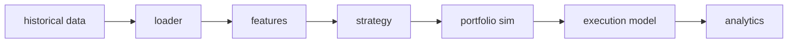

# quant-research-engine

Quantitative trading research engine: strategies, execution costs, and anti-overfitting guardrails.

This is a **research** engine. It takes a price panel, builds causal features, emits target weights from one of four textbook strategies, fills those weights on the **next bar**, subtracts commissions and slippage, and reports Sharpe, Sortino, drawdown, turnover, costs, and exposure.

It is **not**:

- a signal that prints money
- a live trading system, OMS, or broker adapter
- evidence of an edge, on synthetic data or otherwise
- a notebook that curve-fits a ticker until the Sharpe looks like a resume line

Sample runs use **labeled SYNTHETIC** prices (GBM with drift 0, OU, or a cointegrated-like pair). Metrics on those runs are a pipeline demo. Read [RESEARCH.md](RESEARCH.md) before you trust any number this repo can print, including numbers you get after swapping in “real” CSV.

## Pipeline



```
historical data → loader → features → strategy → portfolio sim
    → execution model (fees + slippage, next-bar fill)
    → analytics (Sharpe, Sortino, max DD, vol, turnover, costs, exposure, PnL)
```

Default execution convention, encoded in code not comments: **signal at t uses close[t]; fill at t+1 close after costs.** You cannot trade the same bar’s close you used to form the signal.

## SYNTHETIC data warning

> **`*** SYNTHETIC DATA — NOT A MARKET RESULT ***`**
>
> The bundled generator stamps `DataOrigin.SYNTHETIC` on every invented panel. GBM drift is 0. OU / pairs are toy mean-reverting processes. A noisy, near-zero, or negative **net** Sharpe on that panel is the expected outcome, not a bug. Do not tune lookbacks until the sample Sharpe looks impressive. Do not put that Sharpe in a recruiting packet as if it were a market result.
>
> End of every synthetic CLI report:
> `This run used labeled synthetic prices. Do not treat these metrics as evidence of an edge.`

## Install and one-command sample backtest

Requires Python 3.11+.

```bash
pip install -e ".[dev]"
qre-backtest configs/sample_momentum.yaml
```

Other demos: `configs/sample_mean_reversion.yaml`, `configs/sample_cross_sectional.yaml`, `configs/sample_pairs.yaml`.

Tests:

```bash
pytest
```

CI runs the same install and `pytest` on Python 3.12.

## Strategies

All four are implemented, wired through the CLI, and covered by tests.

| Name | Rule | Notes |
|------|------|--------|
| Time-series momentum | `sign` of lagged lookback return | Equal-weight across names with a valid return |
| Mean reversion | Fade rolling z-score of price vs MA | Window is right-aligned at t |
| Cross-sectional | Rank long-short | Dollar-neutral, unit gross |
| Pairs | Trade residual/spread of two names | Synthetic `ou_pair` process is cointegrated-like; hedge ratio 1 in logs |

None of these is “the DRW secret.” They exist so the rest of the engine (delay, costs, PIT universe, walk-forward) has something to chew on.

## Cost model

```
cost = (commission_bps + slippage_bps) / 1e4 * abs(delta_weight) * nav
```

Costs hit traded notional at fill time. Tests assert **gross PnL >= net PnL** whenever turnover is positive. Ignoring costs is how a lot of “Sharpe 2” notebooks are born; this engine will not let you forget the line item.

## Anti-overfitting guardrails (in code + tests, not just docs)

- **Look-ahead.** Features at t are invariant to prices after t. Test: two panels identical through t, different after; feature values through t match.
- **No future bars.** Rolling windows only use dates `<= t`. `ExecutionModel.fill_delay` must be `>= 1`.
- **Walk-forward.** Expanding or rolling splits with an optional embargo. Test-window dates never appear in train. Parameter choice, if any, belongs on train.
- **Survivorship / point-in-time universe.** Membership is as-of date. The synthetic generator can delist a symbol mid-sample. A delisted name does not appear after `delist_date`. See `src/qre/data/universe.py` and [RESEARCH.md](RESEARCH.md).

Walk-forward is not a magic wand. Picking the YAML with the best walk-forward Sharpe over the full history is still spec-search. That failure mode is discussed in RESEARCH.md; the engine will not stop you from doing it, but it will not pretend the number is clean.

## Layout

```
src/qre/
  types.py              # BarPanel, DataOrigin=SYNTHETIC|USER_PROVIDED
  data/loader.py        # csv/parquet + generate_synthetic_ohlcv (GBM, OU)
  data/universe.py      # PIT membership, delist handling
  features/             # lagged/rolling, look-ahead assertions
  strategies/           # momentum, mean-reversion, cross-sectional, pairs
  portfolio/simulator.py
  execution/model.py    # commission_bps + slippage_bps, next-bar fill
  analytics/metrics.py
  research/walk_forward.py
  cli.py
```

Configs live in `configs/`. Tests live in `tests/`.

## What a number from this repo means

Every `PerformanceReport` carries `data_origin` and `after_costs`. If origin is `SYNTHETIC`, the number is a test of the plumbing. If origin is `USER_PROVIDED`, the number is still only as honest as your panel, your costs, and your research process. Start with [RESEARCH.md](RESEARCH.md).

MIT license. Copyright 2026 taiyuz.
