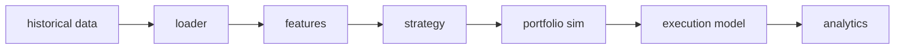

# quant-research-engine

[](https://github.com/taiyuz/quant-research-engine/actions/workflows/ci.yml)

Quantitative trading research engine: strategies, execution costs, and anti-overfitting guardrails.

Most backtests fail for boring reasons: **look-ahead** (using a future close to trade today), **survivorship** (testing only names that still exist), **overfitting** (trying twenty specs and reporting the winner), **train/test leakage** (tuning on the evaluation window), and **ignoring costs and slippage**. This repo is a research simulator that encodes those constraints in code and tests. It is **not** a live OMS, broker adapter, or evidence of an edge.

The engine takes a price panel, builds causal features, emits target weights from one of four textbook strategies, fills those weights on the **next bar**, subtracts commissions and slippage (`ExecutionModel`), and reports Sharpe, Sortino, drawdown, turnover, costs, and exposure. Combinatorial purged CV (AFML Ch.7) and the deflated Sharpe ratio (Bailey & López de Prado 2014) live in the source, not only in a blog post.

Sample runs use **labeled SYNTHETIC** prices (GBM with drift 0, OU, or a cointegrated-like pair). Metrics on those runs are a pipeline demo. Read [RESEARCH.md](RESEARCH.md) before you trust any number this repo can print, including numbers you get after swapping in “real” CSV.

## Pipeline



```
historical data → loader → features → strategy → portfolio sim
    → execution model (fees + slippage, next-bar fill)
    → analytics (Sharpe, Sortino, max DD, vol, turnover, costs, exposure, PnL)
```

Default execution convention, encoded in code not comments: **signal at t uses close[t]; fill at t+1 close after costs.** You cannot trade the same bar’s close you used to form the signal. `ExecutionModel.fill_delay` must be `>= 1`.

## SYNTHETIC data warning

> **`*** SYNTHETIC DATA — NOT A MARKET RESULT ***`**
>
> The bundled generator stamps `DataOrigin.SYNTHETIC` on every invented panel. GBM drift is 0. OU / pairs are toy mean-reverting processes. A noisy, near-zero, or negative **net** Sharpe on that panel is the expected outcome, not a bug. Do not tune lookbacks until the sample Sharpe looks impressive. Do not put that Sharpe in a recruiting packet as if it were a market result.
>
> End of every synthetic CLI report:
> `This run used labeled synthetic prices. Do not treat these metrics as evidence of an edge.`

## Install and how to run pytest

Requires Python 3.11+.

```bash
pip install -e ".[dev]"
pytest
```

That is the same install and `pytest` CI runs on Python 3.12 ([`.github/workflows/ci.yml`](.github/workflows/ci.yml)). A green badge at the top means the suite on `main` passed; it is not a performance claim.

One-command sample backtest (synthetic, labeled as such):

```bash
qre-backtest configs/sample_momentum.yaml
```

Other demos: `configs/sample_mean_reversion.yaml`, `configs/sample_cross_sectional.yaml`, `configs/sample_pairs.yaml`.

Sample CLI output always carries the synthetic labels. Numbers are omitted here on purpose — they are a plumbing demo, not an edge:

```
*** SYNTHETIC DATA — NOT A MARKET RESULT ***
...
This run used labeled synthetic prices. Do not treat these metrics as evidence of an edge.
```

## Strategies

All four are implemented, wired through the CLI, and covered by tests.

| Name | Rule | Notes |
|------|------|-------|
| Time-series momentum | `sign` of lagged lookback return | Equal-weight across names with a valid return |
| Mean reversion | Fade rolling z-score of price vs MA | Window is right-aligned at t |
| Cross-sectional | Rank long-short | Dollar-neutral, unit gross |
| Pairs | Trade residual/spread of two names | Synthetic `ou_pair` process is cointegrated-like; hedge ratio 1 in logs |

None of these is “the DRW secret.” They exist so the rest of the engine (delay, costs, PIT universe, walk-forward, purged CV, DSR) has something to chew on.

## Execution model

Public name: `ExecutionModel` (fees + slippage, next-bar fill). There is no `CostModel` alias.

```
cost = (commission_bps + slippage_bps) / 1e4 * abs(delta_weight) * nav
```

Costs hit traded notional at fill time. Tests assert **gross PnL >= net PnL** whenever turnover is positive. Ignoring costs is how a lot of “Sharpe 2” notebooks are born; this engine will not let you forget the line item.

Honest example (labeled SYNTHETIC fixture, not a market): a 0/1 flip every bar on a 5 bp/day uptrend is a **gross profit** and a **net loss** at 10 bps one-way. Same path, same weights. A notebook that prints only the pre-cost line would call that an edge. Pytest asserts the sign flip in `tests/test_execution_costs.py`. No Sharpe is printed for that fixture on purpose.

## Anti-overfitting guardrails (in code + tests, not just docs)

- **Look-ahead.** Features at t are invariant to prices after t. Test: two panels identical through t, different after; feature values through t match.
- **Look-ahead in labels.** A target dated t with horizon h is invariant to prices after t+h. Remaining-sample returns (`close[T]/close[t] - 1`, “how did this work out by the end of the backtest”) are not. Forward returns are labels, not features. The executable target, given `fill_delay=1`, starts at the fill bar, not the signal bar. Test: `tests/test_label_lookahead.py`.
- **No future bars.** Rolling windows only use dates `<= t`. `ExecutionModel.fill_delay` must be `>= 1`.
- **Walk-forward.** Expanding or rolling splits with an optional embargo. Test-window dates never appear in train. Parameter choice, if any, belongs on train.
- **Purged k-fold / combinatorial purged CV.** López de Prado, *Advances in Financial Machine Learning*, Chapter 7: overlapping labels are purged from train; an embargo follows the test window. CPCV enumerates combinations of test groups. See `src/qre/research/purged_cv.py` and `tests/test_purged_cv.py`.
- **Deflated Sharpe.** Bailey & López de Prado (2014). DSR is PSR evaluated at the expected-max Sharpe under `n_trials` independent tests. A pre-declared spec uses `n_trials: 1`. If you searched twenty YAMLs, pass 20. See `src/qre/analytics/dsr.py`.
- **Survivorship / point-in-time universe.** Membership is as-of date. The synthetic generator can delist a symbol mid-sample. A delisted name does not appear after `delist_date`. See `src/qre/data/universe.py` and [RESEARCH.md](RESEARCH.md).
- **High-turnover cost drag.** 100% daily turnover at 10 bps one-way can flip a modest gross profit into a net loss. That is ignored-costs, not an execution bug. Test: `tests/test_execution_costs.py::test_high_turnover_costs_flip_modest_gross_profit`.

Walk-forward is not a magic wand. Picking the YAML with the best walk-forward Sharpe over the full history is still spec-search. That failure mode is discussed in RESEARCH.md; the engine will not stop you from doing it, but it will not pretend the number is clean. DSR is the correction for that search, not a license to search harder.

## Layout

```
src/qre/
  types.py              # BarPanel, DataOrigin=SYNTHETIC|USER_PROVIDED
  data/loader.py        # csv/parquet + generate_synthetic_ohlcv (GBM, OU)
  data/universe.py      # PIT membership, delist handling
  features/             # lagged/rolling, look-ahead assertions
  strategies/           # momentum, mean-reversion, cross-sectional, pairs
  portfolio/simulator.py
  execution/model.py    # ExecutionModel: commission_bps + slippage_bps, next-bar fill
  analytics/metrics.py
  analytics/dsr.py      # Bailey & López de Prado 2014 DSR
  research/walk_forward.py
  research/purged_cv.py # AFML Ch.7 purge + embargo, CPCV
  research/labels.py    # finite-horizon forward returns; not features
  cli.py
```

Configs live in `configs/`. Tests live in `tests/`.

## What a number from this repo means

Every `PerformanceReport` carries `data_origin` and `after_costs`. If origin is `SYNTHETIC`, the number is a test of the plumbing. If origin is `USER_PROVIDED`, the number is still only as honest as your panel, your costs, and your research process. Start with [RESEARCH.md](RESEARCH.md).

MIT license. Copyright 2026 Taiyu Zhu.
